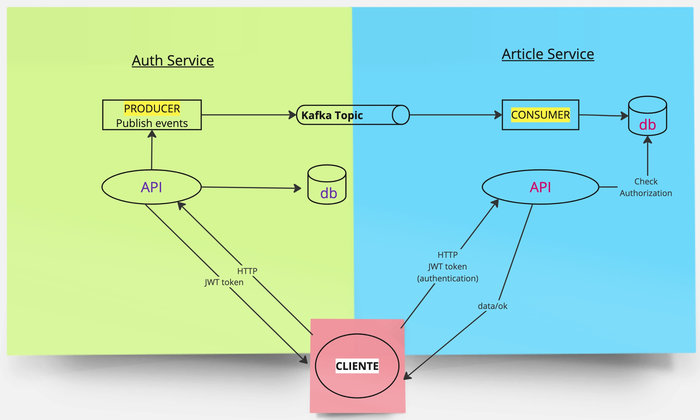

# SHOP PROJECT

This project implemets a CRUD API with authentication and authorization and a messaging system (producder and consumer) with Kafka. 
The project includes two microservices. Both are Rest API implemented using Spring Boot framework.   
One mciroservice is a sing-in / login service.   
The other one is a CRUD of articles.

## Technologies used   
- Microservices   
- Docker
- Kafka
- Spring Security + JWT Token

## How it works

The authentication-server expose 2 endpoints:
+ create user   
  Save the user in db.  
  Publish an event in a kafka topic.
+ login  
  Create a JWT token.

The article-server handle articles. It has:
+ Kafka Consumer. It consumes events and save user data in db.
+ Authentication verification. Check authentication through jwt token deserialization.
+ Authorization verification. Check authorization in db. 
+ Authenticated and authorized article CRUD exposed.




## Dependencies

### Database
Each service has got its own database.  Databases configuration is defined in application.properties files.
Fullfill the following properties with the appropriate values from your environment.
```
spring.datasource.url   
spring.datasource.username   
spring.datasource.password 
```

For an easy set up of the database dependency there is available a docker compose in the project.    
To run, it is necessary to have Docker in your machine and Daemon running.   
Then, run in the terminal: 

```docker compose up```  
(with sudo if you need it)

### Kafka
It is mandatory to have a Kafka broker and a topic named "newUser" created. 

A way to do it can be the next:   
Download the latest Kafka release and extract it.   
Run Kafka broker (my choice is via docker image). 

```
docker pull apache/kafka:3.7.0
docker run -p 9092:9092 apache/kafka:3.7.0

```   
In the terminal, go to the kafka folder created in your directory system.  
Create this topic :

```
bin/kafka-topics.sh --create --topic newUser --bootstrap-server localhost:9092
```

### JDK
Java 17

### Environment   

It is needed to have the environment variable `SUPER_SECRET_KEY` that will be used to decode the token.

## Start application

Go to each springboot application and run the main of each, the authentication-service and the article-service.
